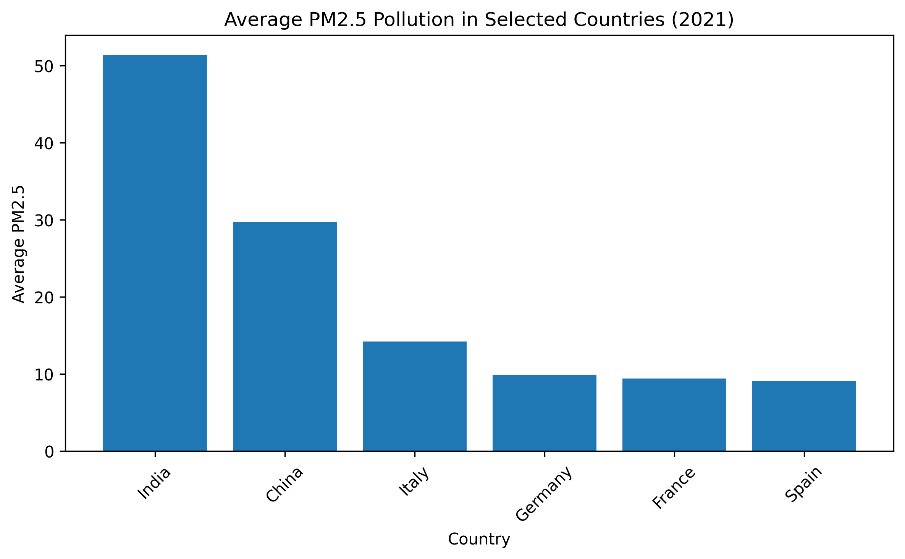
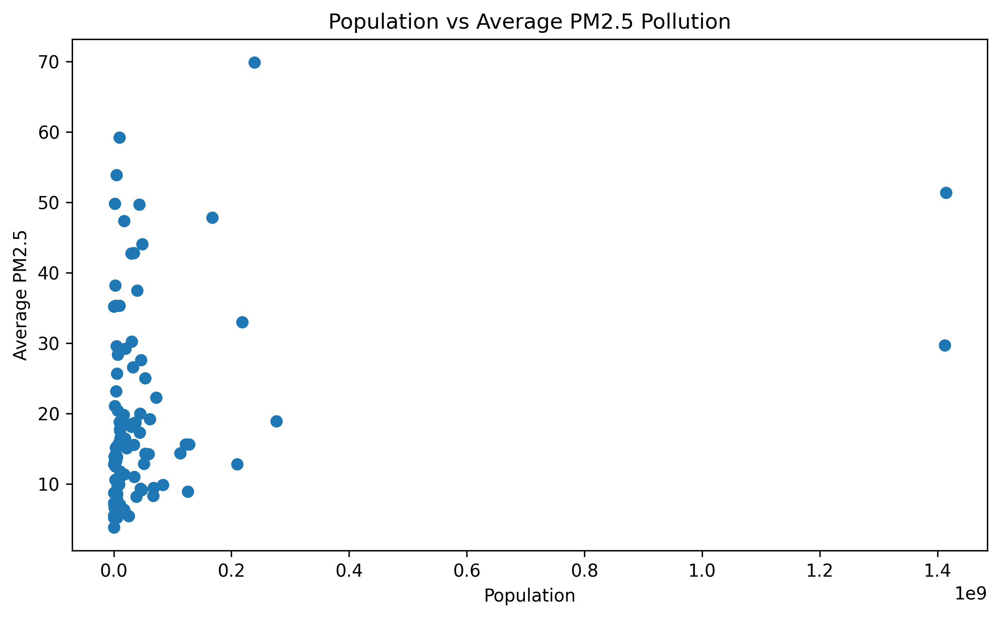

# Real-World Data Wrangling: Population and Air Pollution Analysis

This project analyzes the relationship between country population and PM2.5 air pollution levels using real-world datasets.

## Project Overview

The project demonstrates an end-to-end data wrangling workflow:

- Gathering data from different sources
- Assessing data quality and tidiness
- Cleaning and transforming datasets
- Combining population and air quality data
- Answering a research question with visualizations

## Research Question

How do China, India, and selected European countries compare in terms of average PM2.5 air pollution, and is population size related to pollution levels?

## Datasets

### World Population Dataset

Source: World Bank population dataset via GitHub.

Main variables:

- Country Name
- Country Code
- Year
- Population

### IQAir Air Quality Dataset

Source: Kaggle IQAir city-level air quality dataset.

Main variables:

- City
- Country
- PM2.5 measurements
- Rank

## Key Findings

- India and China showed higher average PM2.5 pollution levels than selected European countries.
- Population size alone did not fully explain differences in pollution levels.
- Additional factors such as industrial activity, energy use, and geography would be useful for deeper analysis.

## Tools Used

- Python
- Pandas
- NumPy
- Matplotlib
- Jupyter Notebook

## Project Structure

```text
real-world-data-wrangling-air-pollution/
├── Data_Wrangling_Project_2V.ipynb
├── README.md
├── requirements.txt
├── data/
│   ├── raw/
│   └── cleaned/
└── images/
```

## Visualizations

### PM2.5 Comparison Across Selected Countries



This visualization compares average PM2.5 levels across China, India, Germany, France, Italy, and Spain.

### Population vs PM2.5 Pollution



This scatter plot explores whether larger populations are associated with higher PM2.5 pollution levels.
